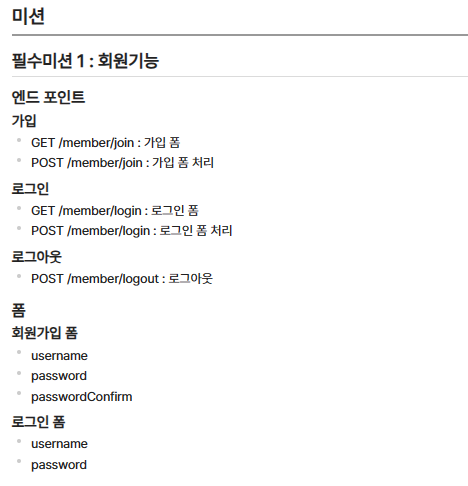
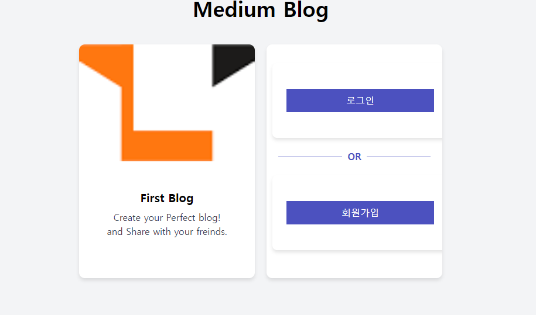
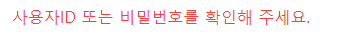
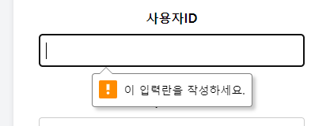
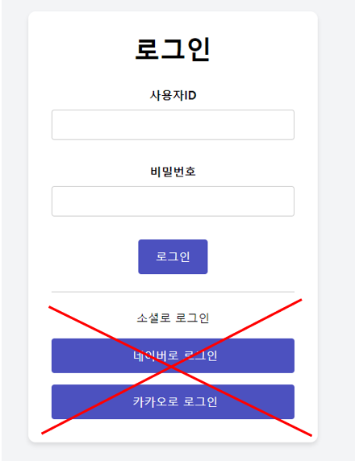

# First Spring Boot Project - MyFirst Blog

## 1. 진행 및 결과물

- 모두 완료

### 1) Account Session
1) Main Form
   - 간단한 구조로 생성
   - 2개의 card 도형 내 폼 형성
   - 1번 째 card : 간단한 블로그 자체에 대한 소개
   - 2 번째 card : 로그인 기능 및 회원가입 넘어 갈 수 있도록 버튼 생성

2) Login Form
    - ID와 PW일치 시, UserSecurity.java에서 유효성 검사 실시
    - 불일치 시 해당 팝업창 생성
   
    - 입력란에 비기입 시 팝업 창 생성
   
    - 로그인 성공 시, /blog/list(메인 블로그) 로 파싱

3)Signup Form