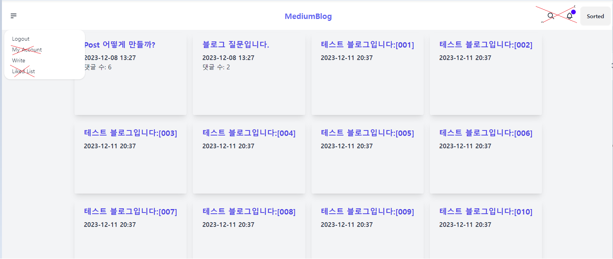

# First Spring Boot Project - MyFirst Blog

## 1. 진행 및 결과물

- 모두 완료

### 1) Account Session
1) Main Form
   - 간단한 구조로 생성
   - 2개의 card 도형 내 폼 형성
   - 1번 째 card : 간단한 블로그 자체에 대한 소개
   - 2 번째 card : 로그인 기능 및 회원가입 넘어 갈 수 있도록 버튼 생성

2) Login Form

 >ID와 PW일치 시, UserSecurity.java에서 유효성 검사 실시
 >불일치 시 해당 팝업창 생성
   

>입력란에 비기입 시 팝업 창 생성
   
   

>로그인 성공 시, /blog/list(메인 블로그) 로 파싱

   

3)Signup Form
>사용자명, 비밀번호, 확인, 이메일 등 기입 가능
>기입한 정보는 h2 Database에 저장
>

>그 외 Login Form과 형식 비슷 (계정 검사, 팝업 창 생성 등)

## 2) Main Blog Sesseion

### 1)BlogList

>박스 형태로 게시물 표시, 12개 씩 표시하도록 생성
   - 제목 밑 게시한 시간과 댓글 수 게시

>상단 navbar 기능
- Logout 클릭 시 Logout 후 첫 화면으로 이동
- Write 클릭 시 게시물 생성란으로 이동
- 'MediumBlog' 클릭 시 bloglist 첫 화면으로 이동하도록 지정
- Sorted 클릭 시, 최신 순 혹은 오래된 순으로 게시물 정렬 가능

### 2) CreateBlog
>제목과 내용 기입 가능하며 게시 가능하고 마크업 기능과 일반 블로그에서 처리할 수 있는 사진 삽입, 텍스트 기능, 도형 등 프로젝트 후에 다듬을 예정

### 3) BlogDetail
> 기재된 블로그 댓글 달릴 수 있도록 게시 그리고 상단의 MediumBlog 클릭 시 BlogList 첫 페이지로 이동 가능

## 2. 아직 수행 못한 기능

1) Account Session
   1) 네이버, 카카오 로그인 및 회원가입 연동(JWT, 토큰세션)
   2) 전반적인 프론트

2) Blog List
   1) My Account에서 내 계정 정보에 대한 내용 확인
   2) 좋아요 누른 블로그 확인 가능
   3) 검색기능
   4) 내 계정에 대한 알림기능
   5) 조회수 기능
   6) 정렬 중 조회순, 좋아요 순 정렬
   
3) Create Blog
   1) 마크다운 기능, 사진 및 그림, 텍스트 변화 등 기능 생성

4) Blog Detail
   1) 댓글, 게시물 등 좋아요 기능
   2) 댓글 정렬기능
   3) 전반적인 프론트(레이아웃)

## 3. 총총
- 프로젝트 기간 : 12/5 13:00 ~ 12/14 16:00
- 프로젝트 명 : MediumProject - 1회 차 (Create My First Blog)
- 새로 배운 기능 :
> ■ 로그인 및 회원가입 등 이용하는 Security에 대해 한 층 더 알았으며 아직 여러 부분으로 부족한 면이 많기에 확실히 처음보다 스프링부트 흐름을 파악하기 쉬워짐.
> 그리고 강의 뿐만 아니라 카카오와 네이버 로그인과 회원가입 기능 생성 시도하며 JWT 기능에 대해 학습할 수 있는 기회가 있었음

- 아쉬운 점:
> ■ 물론 아직 스프링부트가 익숙치 않은 부분에서 흠인 것 같다. 겉으로 보기엔 2~3일 걸릴 거 같은 작품이라 옛날에 판단했었지만 편견이 깨지는 순간이었다.
> 우선 기본기가 아직 부족하고 Controller 및 SecurityFilterChain 더 파악할 필요가 있음

- 결론 :
> 아직 많이 어려움을 겪고 있고 프로젝트 끝난 후에도 Blog는 계속 다듬을 예정(아직 수행하지 못한 기능)
, Spring 첫 프로젝트라 기능적인 면만 전반적으로 파악했으므로 만족